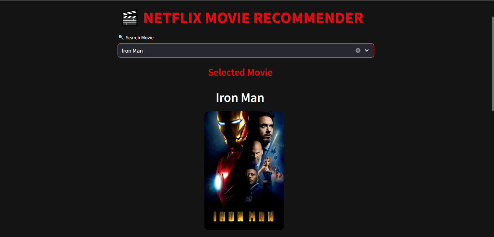
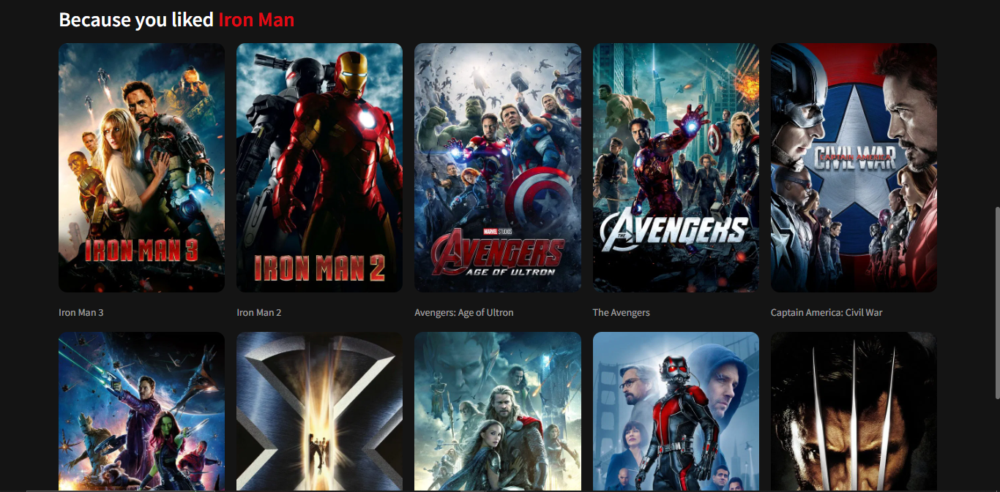

# Netflix Movie Recommendation System

🎬 Netflix-style Movie Recommendation System built using Machine Learning, Cosine Similarity, Streamlit, and TMDB API.

This project was built to explore the practical applications of Machine Learning in recommendation systems. Inspired by platforms like Netflix, I wanted to understand how user preferences can be analyzed to generate personalized content suggestions. Through this project, I gained experience in data preprocessing, feature extraction, similarity-based learning, and web application development using Streamlit. It reflects my growing interest in Machine Learning and AI-driven solutions.

### Home Screen



### Recommendations


## Features

* Search movies instantly
* Netflix-inspired interface
* Movie poster display
* Content-based recommendations
* TMDB integration
* Responsive UI

## Technologies Used

* Python
* Pandas
* NumPy
* Scikit-Learn
* Streamlit
* TMDB API

## Installation

Clone the repository

```bash
git clone https://github.com/karrivinay54/Movie-Recommender.git
```

Install dependencies

```bash
pip install -r requirements.txt
```

Run the application

```bash
streamlit run app.py
```

## Dataset

TMDB 5000 Movies Dataset

Files Used:

* tmdb_5000_movies.csv
* tmdb_5000_credits.csv

## How It Works

The recommendation engine analyzes movie metadata such as genres, keywords, cast, crew, and overview text. These features are transformed using CountVectorizer, and Cosine Similarity is used to identify movies with similar content.

The system uses:

* Data preprocessing
* Feature engineering
* CountVectorizer
* Cosine Similarity

to recommend movies similar to the selected movie.

## Future Improvements

- IMDb integration
- Movie ratings display
- Horizontal Netflix-style carousel
- Genre-based filtering
- User watchlists
- Hybrid recommendation system

 ## Skills Gained

- Data preprocessing
- Feature engineering
- Natural Language Processing basics
- Cosine Similarity
- Machine Learning workflows
- API integration
- Streamlit web development
- GitHub project management

## Author

**Karri Vinay**

B.Tech – Electronics & Communication Engineering  
RGUKT IIIT Nuzvid

GitHub: https://github.com/karrivinay54

**similarity.npy not included due to GitHub file size limitations.
Generate it using the provided notebook.**


## Additional Downloads

Due to GitHub file size limitations, the following files are hosted on Google Drive:

- similarity.npy : https://drive.google.com/file/d/1F_hlFCMftbPoIOCxEKKuUSBe50dsr02L/view?usp=drive_link
- tmdb_5000_movies.csv.zip : https://drive.google.com/file/d/14TsORVmk-KPo7EfME3vq0laW44GBpNrM/view?usp=sharing
- tmdb_5000_credits.csv.zip : https://drive.google.com/file/d/1BIYvL-s7E2MLsr-iCRM9hbY2C1tfMbCu/view?usp=sharing
